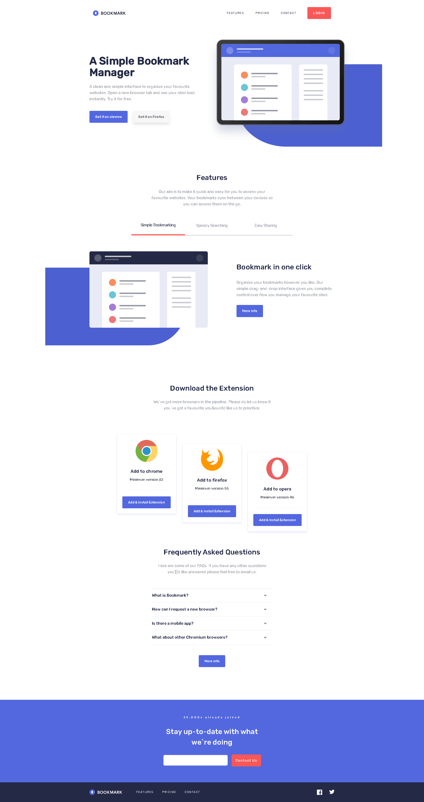

# Frontend Mentor - Bookmark landing page solution

This is a solution to the [Bookmark landing page challenge on Frontend Mentor](https://www.frontendmentor.io/challenges/bookmark-landing-page-5d0b588a9edda32581d29158). Frontend Mentor challenges help you improve your coding skills by building realistic projects.

## Table of contents

- [Overview](#overview)
  - [The challenge](#the-challenge)
  - [Screenshot](#screenshot)
  - [Links](#links)
- [My process](#my-process)
  - [Built with](#built-with)
  - [What I learned](#what-i-learned)
  - [Continued development](#continued-development)
  - [Useful resources](#useful-resources)
- [Author](#author)

## Overview

### The challenge

Users should be able to:

- View the optimal layout for the site depending on their device's screen size
- See hover states for all interactive elements on the page
- Receive an error message when the newsletter form is submitted if:
  - The input field is empty
  - The email address is not formatted correctly

### Screenshot

### Links

- Solution URL: [https://github.com/Sittisukintaruk/bookmark-landing-page-master](https://github.com/Sittisukintaruk/bookmark-landing-page-master)
- Live Site URL: [Add live site URL here](https://your-live-site-url.com)

## My process

### Built with

- Semantic HTML5 markup
- Flexbox
- CSS Grid
- [React](https://reactjs.org/) - JS library
- [Vite](https://vitejs.dev/) - JS library
- [Chakra UI](https://chakra-ui.com/) - For styles

### What I learned

น่าจะเป็นโปรเจ็คแรกๆเลยที่ปิดยาก เพราะการลองทำพวก custom component ของตัว Ui library อย่าง Chakra UI ด้วยตัวเองเพื่อนำมาใช้จริงๆ ยังเป็นเรื่องที่ใหม่สำหรับผมอยู่แต่ก็ผ่านไปด้วยดี และการลองจัด File Structure ใหม่หมดเพื่อให้สามารถมองหาไฟล์ได้สะอาดตามากขึ้น

### Continued development

ในครั้งหน้าผมว่าจะลองใช้ Storybook ดู เพราะอยากลองอะไรที่มันแปลกใหม่ขึ้นไปอีก ได้ยินมาว่า Storybook ช่วยให้เราสามารถสร้าง component ที่สำเร็จในตัว คือประมาณว่าใช้งานได้ เปลี่ยนแปลงได้จากค่า props แถมยังช่วยเราสร้าง Doc ของ component เราเองได้อีกด้วย นี้อาจจะเสมื่อนเราสร้าง Design System ของตัวเอง พอนึกแล้วก็รู้สึกว่าอย่างเท่เลย 555 😄.

### Useful resources

- [React Hook Form](https://react-hook-form.com/) - ช่วยมากกับการจัดการพวก form ช่วยลดความยุ่งยากไปมากเลย เพราะเช็คได้ว่าสิ่งที่พิมพ์มันตรงกับที่เรากำหนดไว้ไหม

## Author

- Frontend Mentor - [@Sittisukintaruk](https://www.frontendmentor.io/profile/Sittisukintaruk)
